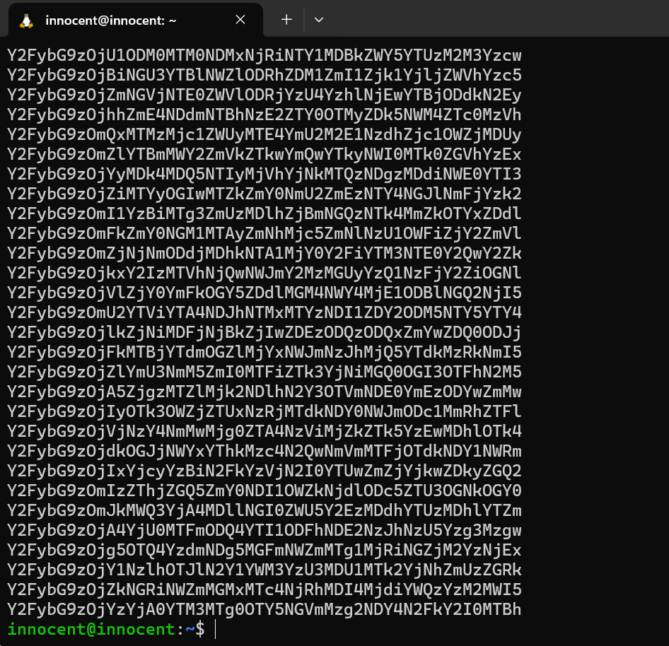

# Authentication Vuln

Authentication vulnerabilities can allow attackers to gain access to sensitive data and functionality. A successful authentication attack allow attackers to access all data and functionality  that the account has. If the account has a high-privileged such as sysadmin, they could take full control the application.

# How does it arise?

Occur one in two types:

 - The authentication mechanisms are weak (default credentials).
 - Logic flaws or poor coding in the implementation cause ``Broken Authentication``.

# How many types of Authentication vuln?

### Vuln in password-based authentication

 - Brute-force attacks.
 - HTTP basic authentication.

### Vuln in multi-factor authentication

 - Two-factor authentication tokens.
 - Bypassing two-factor authentication.
 - Brute-force two-factor authentication codes.

### Vuln in other authentication mechanisms

 - Keeping users logged in.
 - Resetting user passwords.
 - Changing user password.

# How to detect?

 - Use tool like Burp, Nmap,...
 - Manual testing (brute-force, access restricted pages).

# How to exploit?

### Password-based authentication

Example:

```php
$connect = mysqli_connect ('localhost', 'root', '', 'user');

$username = $_POST['username'];
$password = $_POST['password'];

$query = "SELECT * FROM users WHERE username = '$username'";
$result = mysqli_query($connect, $query);
$count = mysqli_num_rows($result);

if ($count == 1) {
    $row = mysqli_fetch_array($result);
    if ($password != $row['password']) {
        echo "Wrong password!";
    }
} else {
    echo "Wrong username!";
}
```

If the ``username`` does not exist, it will return ``Wrong username!``.


If ``username`` found but wrong ``password`` it will return ``Wrong password!``.


So the solution is we first brute-force the ``username`` to find the exact username then we brute-force the ``password``.


The credentials is ``ec2-user:computer``.

### Multi-factor authentication


In this case, we are provided a valid credential, we need to bypass the 2FA mechanism. It has a webmail to recieve 2FA code of user ``wiener``.


First, we log into ``wiener:peter``, take requests to understand the mechanism of the application.


After login at ``/login``, it will redirect to ``/login2`` to verify 2FA code. Send with header Cookie ``verify=wiener``.


We test by send many requests and know that the application does not block brute-force attacks. Morever, ``mfa-code`` include four random numbers so we can perform a brute-force attack after change the value of cookie to ``verify=carlos``.


### Other authentication mechanisms


Like the previous lab, update to add ``Stay logged in`` function. First, login with ``wiener`` account.


The application will remember the ``login`` by cookie with value ``stay-logged-in=d2llbmVyOjUxZGMzMGRkYzQ3M2Q0M2E2MDExZTllYmJhNmNhNzcw``


Analyst the value of the cookie, maybe it is ``Base64`` encode. The value after decode is ``wiener:51dc30ddc473d43a6011e9ebba6ca770``.


We found that ``51dc30ddc473d43a6011e9ebba6ca770`` is a common format, maybe ``hash encrypt``. After decrypt, the value will be ``peter``.


So we can understand the mechanism create cookie is ``hash`` the password and then ``encode base64`` with the format ``username:hash``. Here is my code to create a list value of cookie to brute-force.

```python
import hashlib
import base64

def hash_each_line(file_path):
    with open(file_path, 'r') as file:
        for line in file:
            stripped_line = line.strip()
            if stripped_line:
                md5_hash = hashlib.md5(stripped_line.encode()).hexdigest()
                combined_string = 'carlos:' + md5_hash
                base64_hash = base64.b64encode(combined_string.encode()).decode()
                base64_hash = base64_hash.rstrip('=')
                print(base64_hash)

file_path = 'hash_passwd.txt'
hash_each_line(file_path)
```



Finally, just brute-force with ``Burp intruder`` to find correct value.


# How to prevent?

 - Use strong password.
 - Implement brute-force protection.
 - Implement multi-factor authentication.