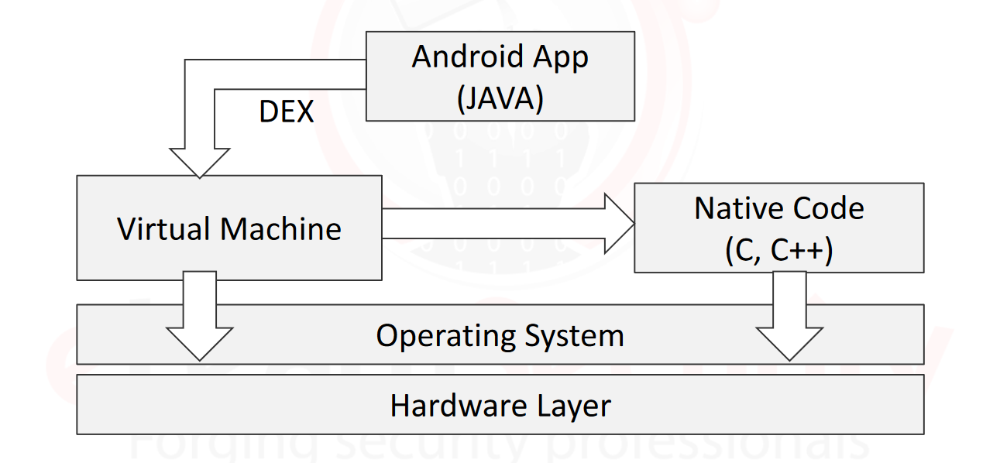

# Tìm hiểu về kiến trúc và cơ chế bảo mật của hệ thống Android.

 - Tên tài liệu: Mobile Application Security and Penetration Testing v 2.5
 - Thực hiện: Trọng
 - Cập nhật lần cuối: 29/09/2024

1. [Architecture](#Architecture)

Đây là kiến trúc cơ bản của một hệ thống Android. Android là một hệ điều hành mã nguồn mở dựa trên nền tảng Linux. Gồm có 6 tầng là Linux Kernel, Hardware Abstraction Layer – HAL, Android Runtime, Native C/C++ Libraries, Java API Framework, System Apps.

<a name="The Linux Kernel: The Brain of Android">The Linux Kernel: The Brain of Android</a>

Linux Kernel (nhân linux) giúp mọi thứ trong hệ thống Android hoạt động trơn tru như thực hiện nhiều tác vụ cùng một lúc, quản lý bộ nhớ của thiết bị (RAM) giúp cho thiết bị không xảy ra tình trạng hết sạch bộ nhớ.

<a name="Hardware Abstraction Layer (HAL): Your Device’s Translator">Hardware Abstraction Layer (HAL): Your Device’s Translator</a>

Thiết bị Android toàn bộ là phần cứng như máy ảnh, chip Bluetooth,... Để các ứng dụng và phần cứng giao tiếp được với nhau, lúc này ta cần đến HAL. HAL là thành phần giúp các ứng dụng và phần cứng có thể giao tiếp với nhau, khi API truy cập vào phần cứng của thiết bị, Android sẽ tải xuống các mô-đun cho các phần cứng đó.

<a name="Android Runtime (ART): The App Magician">Android Runtime (ART): The App Magician</a>

Android Runtime (ART) là môi trường chạy (runtime) được sử dụng bởi hệ điều hành Android để thực thi các ứng dụng. ART thay thế cho Dalvik, môi trường chạy trước đó trong các phiên bản Android cũ hơn (trước Android 5.0 Lollipop).

Dalvik VM sẽ thực thi biên dịch từ bytecode sang mã máy khi khởi chạy ứng dụng. Đối với ART thì mã bytecode sẽ được biên dịch ngay lúc cài đặt, điều này giúp làm giảm thời gian khởi động ứng dụng cho các lần sau và cải thiện được hiệu suất.

Ngoài ra ART còn nhiều nhiệm vụ khác như quản lý bộ nhớ, hỗ trợ debug,... ART còn có thể xử lý nhiều ứng dụng cùng một lúc.

<a name="Native C/C++ Libraries: The Builders of Android’s Core">Native C/C++ Libraries: The Builders of Android’s Core</a>

Những thành phần và dịch vụ hệ thống cốt lõi như ART và HAL được xây dựng từ mã gốc, được viết bằng ngôn ngữ C và C++. Android cung cấp các khung API Java để hiển thị chức năng của một số thư viện C/C++ gốc (Native C/C++ Libraries) cho các ứng dụng. 

Khi sử dụng những tác vụ cần yêu cầu đồ họa hoặc hiệu năng ở mức cao, các thư viện này sẽ đáp ứng nhu cầu dành cho các tác vụ đó.

<a name="Java API Framework: Building Blocks for App Magic">Java API Framework: Building Blocks for App Magic</a>

Java API Framework như một hộp công cụ dành cho các nhà phát triển ứng dụng. Bên trong, có các công cụ để tạo giao diện người dùng (UI), truy cập các tài nguyên như hình ảnh và chuỗi cũng như quản lý thông báo. Cho dù đó là thiết kế giao diện ứng dụng đẹp mắt hay xử lý các tác vụ nền, các API này đều đảm nhận nhiều công việc cho người tạo ứng dụng.

Các dịch vụ chính của Java API Framework bao gồm:
 - Trình quản lý hoạt động (Activity Manager): Kiểm soát tất cả các khía cạnh trong vòng đời của ứng dụng và activity stack.
 - Nhà cung cấp nội dung (Content Providers): Cho phép ứng dụng xuất bản và chia sẻ dữ liệu với các ứng dụng khác.
 - Trình quản lý tài nguyên (Resource Manager): Cung cấp quyền truy cập vào các tài nguyên không code như chuỗi, cài đặt màu, bố cục giao diện người dùng.
 - Trình quản lý thông báo (Notifications Manager): Cho phép ứng dụng hiển thị những cảnh báo và thông báo đến người dùng.
 - Hệ thống xem (View System): Tập hợp nhiều dạng khung hình có thể mở rộng, sử dụng để tạo giao diện cho người dùng ứng dụng.

<a name="System Apps">System Apps</a>

Đây là tầng cao nhất trong một hệ thống Android, các ứng dụng được tạo ra sẽ được cài đặt trên tầng này.

2. [Android_Virtual_Machine](#Android_Virtual_Machine)

Android Virtual Machine (VM) là môi trường ảo hóa được sử dụng để thực thi các ứng dụng Android. Trong hệ điều hành Android, Virtual Machine hoạt động như một lớp trung gian giữa phần cứng và các ứng dụng, cho phép các ứng dụng được viết bằng Java (hoặc các ngôn ngữ khác) có thể chạy trên các thiết bị Android.

<a name="Dalvik Virtual Machine (DVM)">Dalvik Virtual Machine (DVM)</a>

Dalvik là Virtual Machine ban đầu được sử dụng trong Android. DVM được tối ưu hóa để chạy trên thiết bị di động với hạn chế về tài nguyên, như RAM và CPU.

- Bytecode Dalvik: Khi lập trình viên viết ứng dụng Android, mã Java sẽ được biên dịch thành bytecode Java thông thường. Sau đó, bytecode này được chuyển đổi sang bytecode Dalvik (tập lệnh DEX - Dalvik Executable), giúp nó chạy được trên Dalvik VM.
 - Biên dịch Just-In-Time (JIT): Dalvik sử dụng biên dịch JIT để chuyển đổi bytecode thành mã máy tại thời điểm chạy ứng dụng. Điều này có thể làm giảm hiệu suất, đặc biệt là khi khởi động ứng dụng.

<a name="Android Runtime (ART)">Android Runtime (ART)</a>

Android Runtime (ART) là thay thế cho Dalvik kể từ Android 5.0 (Lollipop) và hiện là môi trường chạy mặc định trong tất cả các thiết bị Android hiện đại.

- Biên dịch Ahead-of-Time (AOT): ART sử dụng AOT để biên dịch mã bytecode ngay khi ứng dụng được cài đặt. Điều này cải thiện hiệu suất và giảm thời gian khởi động ứng dụng, so với JIT trong Dalvik.
- Quản lý bộ nhớ tốt hơn: ART cải tiến cơ chế quản lý bộ nhớ và thu gom rác (garbage collection), giúp giảm thiểu gián đoạn trong ứng dụng.

<a name="How Android VM works?">How Android VM works?</a>

Tập lệnh DEX: Ứng dụng Android được viết bằng Java hoặc Kotlin, sau đó được biên dịch thành bytecode DEX, phù hợp để chạy trên Dalvik hoặc ART. DEX là dạng bytecode nén và tối ưu cho thiết bị di động với tài nguyên hạn chế.

Quản lý đa luồng (Multithreading): Android VM hỗ trợ đa luồng, giúp các ứng dụng có thể chạy các tác vụ song song, tăng hiệu suất và khả năng phản hồi. Mỗi ứng dụng Android được chạy trong một tiến trình Linux riêng biệt và có bộ nhớ riêng.

Garbage Collection (GC): Cả Dalvik và ART đều sử dụng cơ chế thu gom rác để tự động giải phóng bộ nhớ không còn được ứng dụng sử dụng. Tuy nhiên, ART cải tiến GC để hoạt động hiệu quả và ít gây gián đoạn hơn so với Dalvik.

3. [Android_Security_Model](#Android_Security_Model)

UID Separation và Sandboxing là hai cơ chế bảo mật quan trọng trong Android nhằm đảm bảo rằng các ứng dụng chạy độc lập và không can thiệp vào dữ liệu hoặc tài nguyên của nhau.

<a name="UID Separation (Tách biệt UID)">UID Separation (Tách biệt UID)</a>

UID (User ID) trong Android dựa trên nhân Linux, nơi mỗi ứng dụng được cấp một UID riêng khi được cài đặt. Điều này tạo ra một sự tách biệt rõ ràng giữa các ứng dụng, tương tự như cách Linux quản lý các tài khoản người dùng.

Về cách hoạt động Mỗi ứng dụng có một UID duy nhất và chạy trong một tiến trình độc lập, tương đương với một ``người dùng`` riêng trên hệ thống Linux. Các tài nguyên và tệp tin của một ứng dụng được sở hữu bởi UID của ứng dụng đó và không thể truy cập bởi các ứng dụng khác nếu không có quyền cụ thể.

<a name="Sandboxing">Sandboxing</a>

Sandboxing là một cơ chế bảo mật tạo ra một môi trường cô lập cho từng ứng dụng Android, dựa trên sự phân tách UID, nhằm đảm bảo rằng các ứng dụng không thể tương tác hoặc can thiệp với hệ thống và các ứng dụng khác mà không có sự cho phép.

Về cách hoạt động Mỗi ứng dụng Android chạy trong một sandbox riêng biệt, nghĩa là một không gian biệt lập của hệ thống. Sandbox này dựa vào nhân Linux và cơ chế UID để cô lập các ứng dụng. Các tài nguyên như bộ nhớ, tệp tin, dữ liệu người dùng đều nằm trong phạm vi sandbox của ứng dụng và không thể bị truy cập bởi các ứng dụng khác nếu không có quyền.

<a name="UID Separation & Sandboxing">UID Separation & Sandboxing</a>

UID Separation và Sandboxing hoạt động song song: UID tạo ra một ranh giới an ninh rõ ràng cho từng ứng dụng ở mức nhân Linux, trong khi sandboxing cung cấp một môi trường cô lập ở mức ứng dụng. Nhờ sự kết hợp này, Android có thể cô lập và bảo vệ cả dữ liệu ứng dụng và hệ điều hành khỏi các tấn công tiềm tàng.

