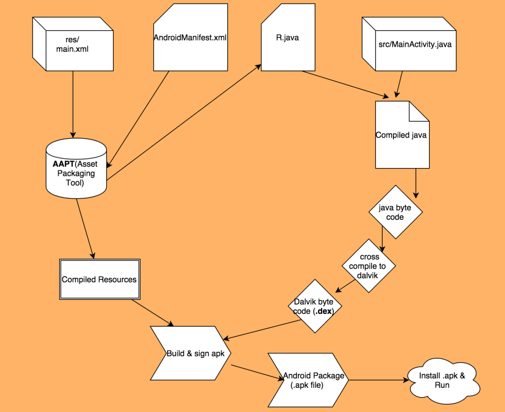
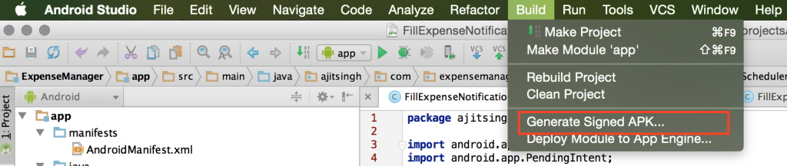
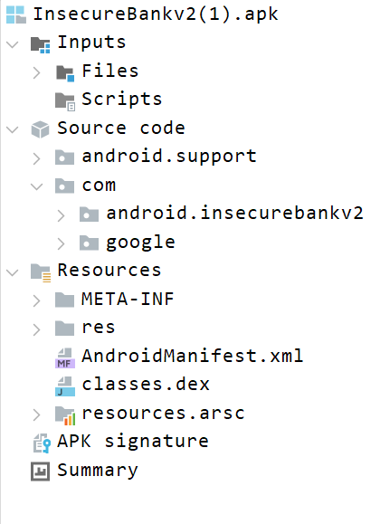
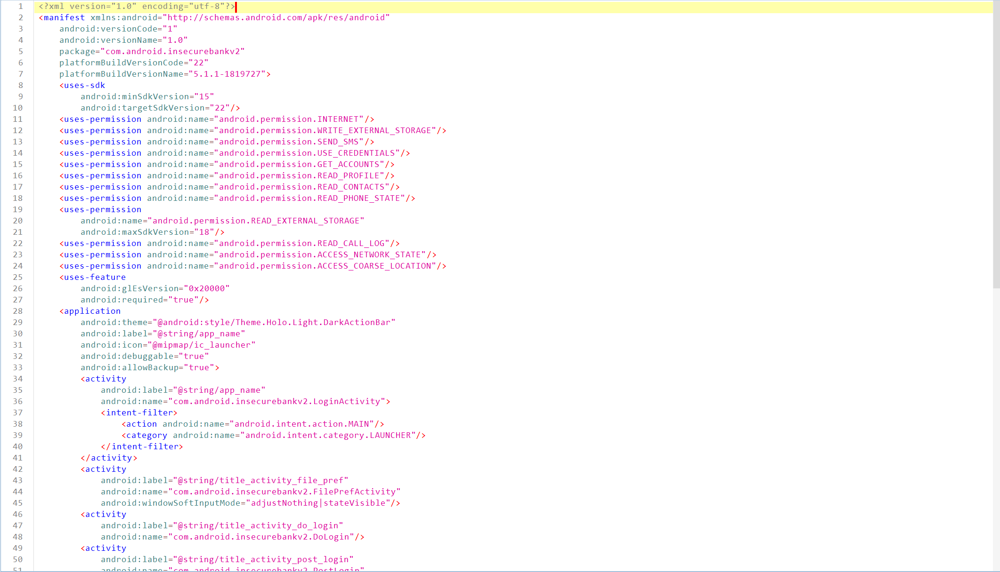

# Android Build Process

 - Tên tài liệu: Mobile Application Security and Penetration Testing v 2.5
 - Thực hiện: Trọng
 - Cập nhật lần cuối: 07/10/2024

 # Table of Contents

  - [Compiling Process](#Compiling_Process)
  - [APK Structure](#APK_Structure)
  - [Code Signing](#Code_Signing)

1. [Compiling Process](#Compiling_Process)

Quá trình compiling android app bao gồm rất nhiều bước. Trước khi đi vào các bước cụ thể, mình sẽ tham khảo sơ đồ tóm gọn các bước trong quá trình compiling android app dưới đây.



<a name="AAPT Tool">AAPT Tool</a>

``AAPT`` là viết tắt của ``android assets pakaging tool``, là một công cụ trong Android SDK được sử dụng để biên dịch và đóng gói các tài nguyên cho ứng dụng Android.

 - Biên dịch tài nguyên: AAPT chuyển đổi các tài nguyên XML (như ``strings.xml``, ``colors.xml``, ``styles.xml``) thành định dạng nhị phân có thể sử dụng trong ứng dụng.
 - Tạo file ``R.java``: AAPT tạo ra tệp ``R.java``, chứa các ID tham chiếu đến các tài nguyên của ứng dụng. Điều này cho phép lập trình viên truy cập các tài nguyên (như chuỗi văn bản, hình ảnh) từ mã Java.

<a name="Android Build Process Steps">Android Build Process Steps</a>

 - ``AAPT`` lấy tất cả các tài nguyên có trong thư mục ``res/`` và ``AndroidManifest.xml`` (metadata của android app) và biên dịch chúng. Sau đó tạo ra một class ``R.java`` có tất cả các id tài nguyên.

 ```
 $ aapt
Android Asset Packaging Tool

Usage:
 aapt l[ist] [-v] [-a] file.{zip,jar,apk}
   List contents of Zip-compatible archive.

 aapt d[ump] [--values] [--include-meta-data] WHAT file.{apk} [asset [asset ...]]
   strings          Print the contents of the resource table string pool in the APK.
   badging          Print the label and icon for the app declared in APK.
   permissions      Print the permissions from the APK.
   resources        Print the resource table from the APK.
   configurations   Print the configurations in the APK.
   xmltree          Print the compiled xmls in the given assets.
   xmlstrings       Print the strings of the given compiled xml assets.

 aapt p[ackage] [-d][-f][-m][-u][-v][-x][-z][-M AndroidManifest.xml] \
        [-0 extension [-0 extension ...]] [-g tolerance] [-j jarfile] \
        [--debug-mode] [--min-sdk-version VAL] [--target-sdk-version VAL] \
        [--app-version VAL] [--app-version-name TEXT] [--custom-package VAL] \
        [--rename-manifest-package PACKAGE] \
        [--rename-instrumentation-target-package PACKAGE] \
        [--utf16] [--auto-add-overlay] \
        [--max-res-version VAL] \
        [-I base-package [-I base-package ...]] \
        [-A asset-source-dir]  [-G class-list-file] [-P public-definitions-file] \
        [-S resource-sources [-S resource-sources ...]] \
        [-F apk-file] [-J R-file-dir] \
        [--product product1,product2,...] \
        [-c CONFIGS] [--preferred-configurations CONFIGS] \
        [--split CONFIGS [--split CONFIGS]] \
        [--feature-of package [--feature-after package]] \
        [raw-files-dir [raw-files-dir] ...] \
        [--output-text-symbols DIR]
```

 - Sau đó tất cả các file java bao gồm ``R.java`` sẽ được biên dịch hết về dạng bytecode.
 - Để ứng dụng chạy trên dalvik VM thì bytecode sẽ được biên dịch sang Dalvik byte code (``.dex`` files).
 - Tiếp theo file ``.dex`` và các tài nguyên sẽ được biên dịch cùng nhau để tạo thành ``.apk`` file.
 - Cuối cùng để tạo được một file .apk hoàn chỉnh có thể sử dụng được, ta cần cung cấp cho nó một chữ ký.



2. [APK Structure](#APK_Structure)

Các app android tất cả đều được đóng gói trong một file ``.apk``, thực chất nó chỉ là một file ``zip``. Nếu sửa đổi đuôi file thì ta có thể trích xuất được nội dung của nó.



Tiếp theo mình sẽ đi đến các phần nội dung có trong một file ``.apk``. Các nội dung này là cần thiết khi khởi chạy android app, bao gồm:

 - ``AndroidManifest.xml`` - file cần thiết để mô tả về ứng dụng. File manifest chứa các thông tin chính về các thành phần của ứng dụng như:

    - Các pakage name của ứng dụng.
    - Các thành phần của ứng dụng chẳng hạn như activities hay resources.
    - Các quyền cần thiết mà ứng dụng yêu cầu khi chạy ứng dụng và các quyền cần thiết khi truy cập vào thông tin của ứng dụng từ các ứng dụng khác.
    - Các thông tin khác chẳng hạn như phiên bản android yêu cầu tối thiểu hay các thiết bị được hỗ trợ.



 - ``assets`` - chúng ta có thể kiểm soát các loại tài nguyên của ứng dụng bằng cách phân cấp thư mục, tạo ra các thư mục riêng cho từng thành phần. Nếu ứng dụng có thể hiển thị videos hay sử dụng các template thì sẽ được chứa trong thư mục này. Ngoài ra một số frameworks còn sử dụng thư mục này để lưu trữ code hay dữ liệu.

    - Các ứng dụng ``Cordova`` hay ``React-native`` lưu trữ code js trong thư mục assets.
    - Ứng dụng Maui, Xamarin lưu trữ file ``.dll`` trong thư mục ``assemblies`` (hoạt động tương tự như ``assets``).

 - ``classes.dex`` - đây là các classes java được biên dịch thành ``dex`` file để chạy trên thiết bị. Mặc dù ``dex`` file bắt nguồn từ Dalvik VM tuy nhiên nó có thể được sử dụng cho cả ART.