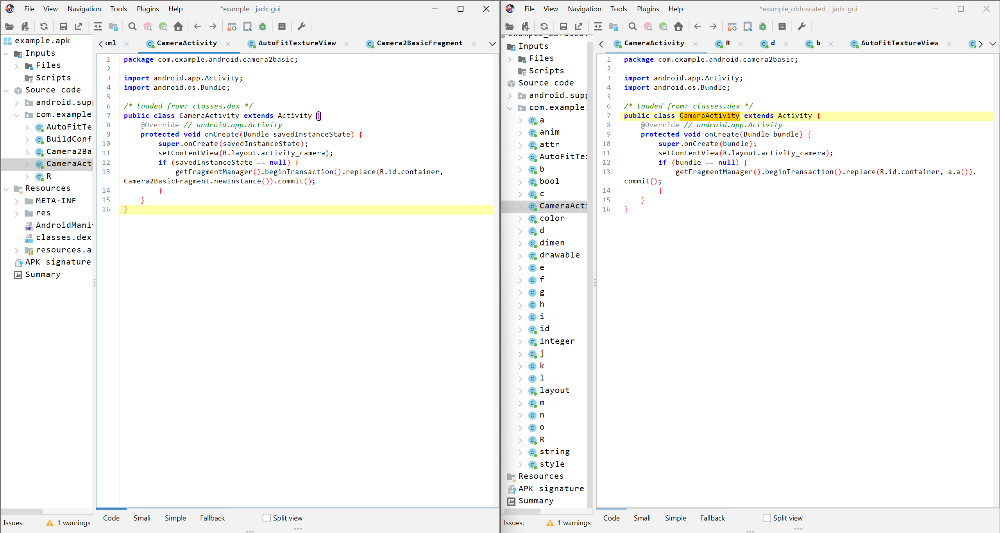

# Android Build Process

 - Tên tài liệu: Mobile Application Security and Penetration Testing v 2.5
 - Thực hiện: Trọng
 - Cập nhật lần cuối: 07/10/2024

 # Table of Contents

  - [Decompile Tool](#Decompile_Tool)
  - [Smali/Backsmali](#Smali/Backsmali)
  - [Obfuscation](#Obfuscation)
  - [Additional APK Contents](#Additional_APK_Contents)
  - [Hardware Optimization](#Hardware_Optimization)
  - [OEM](#Apps)

1. [Decompile Tool](#Decompile_Tool)

Như ở bài viết trước thì mình có đề cập đến một vài công cụ dùng cho việc decompile apk như apktool, jadx,... Ngoài ra thì còn một vài công cụ khác như là: dex2jar, jd-gui.

<a name="dex2jar ">dex2jar</a>

Là công cụ dùng để chuyển đổi các tệp tin ``DEX`` (Dalvik Executable) trong ứng dụng Android thành các tệp tin ``JAR`` (Java Archive).

Phân tích tệp ``DEX``: Đọc và phân tích cấu trúc của tệp DEX, bao gồm các lớp, phương thức, và thuộc tính.

Chuyển đổi mã bytecode: Chuyển đổi mã bytecode Dalvik thành mã bytecode Java tương đương, giữ nguyên logic và flow của ứng dụng.

Tạo tệp JAR: Đóng gói các tệp CLASS được chuyển đổi vào tệp JAR.

Chuyển đổi từ file ``.dex``:

```
d2j-dex2jar.sh classes.dex
```

Chuyển đổi từ file ``.apk``:

```
d2j-dex2jar.sh app.apk
```

Note: ``--force`` - Ghi đè tệp JAR nếu đã tồn tại.

<a name="jd-gui ">jd-gui</a>

JD-GUI là một công cụ decompiler Java, cho phép xem mã nguồn Java từ các tệp JAR hoặc CLASS đã được biên dịch.

Decompile tệp JAR/CLASS: Chuyển đổi bytecode Java trở lại mã nguồn Java có thể đọc được.

2. [Smali/Backsmali](#Smali/Backsmali)

Một trong những lợi ích lớn nhất của smali là cho phép mình kiểm soát các hoạt động một cách chi tiết hơn là java, vì nó hoạt động ở dạng bytecode. Giúp cho việc hooking hay chỉnh sửa các hoạt động của ứng dụng mà không ảnh hướng đến java source code.

<a name="Smali ">Smali</a>

Smali là một dạng ngôn ngữ assembly dành cho cái file có định dạng dex, khi tiến hành tạo một ứng dụng apk sẽ có cấu trúc dưới đây:


Như trong cấu trúc thì có tầng gọi là Dalvik Bytecode, tại đây sẽ chứa các ``classes.dex`` là các mã nhị phân mà nền tảng android có thể hiểu được. Vì ở dạng nhị phân nên để chúng ta đọc được là điều không thể, do đó cần chuyển nó sang một định dạng khác mà có thể đọc, có thể sửa đổi được. Lúc này thì smali xuất hiện, ta sẽ tiến hành decompile các file dex thành file smali, sau đó sửa đổi và tiến hành recompile lại thành file apk.

Ví dụ khi khai báo biến trong java:

```
int x = 42; 
```

Tuy nhiên khi chuyển về dạng dex code để nền tảng android có thể hiểu được thì nó sẽ trở thành:

```
13 00 2A 00
```

Sau đó mình tiến hành convert nó về dưới dạng smali để có thể dễ dàng đọc hiểu và sửa đổi hơn:

```
const/16 v0, 42 
```

<a name="Registers & Locals Directive  ">Registers & Locals Directive </a>

Với smali, các thanh ghi được sử dụng để chứa các kiểu dữ liệu 32bit, để có thể chứa được kiểu dữ liệu 64bit (long/double) ta cần dùng đến 2 thanh ghi.

Mỗi phương thức và hàm khi được định nghĩa thì sẽ khai báo luôn số lượng các thanh ghi dành cho nó.

Lệnh ``.registers`` chỉ định tổng số thanh ghi được sử dụng trong phương thức, lệnh ``.locals`` thay thế chỉ định số lượng thanh ghi không tham số được sử dụng trong phương thức.

Ví dụ với java code, hàm ``addInt`` với 2 phương thức là ``static`` và ``non-static``:


Chuyển đoạn code này thành smali bằng locals directive, ta thấy ``.locals 1`` do chỉ có 1 biến cục bộ là ``v0`` được gọi trong suốt quá trình, còn các tham số như ``p0`` và ``p1`` là tham số được truyền vào nên sẽ không được tính.


Chuyển đoạn code này thành smali bằng registers directive, có thể thấy số lượng thanh ghi cần dùng ở phương thức ``static`` là 3 còn ở phương thức ``non-static`` là 4 mặc dù chức năng của 2 phương thức này là như nhau. Ta có thể dễ nhận thấy nhất là ở mỗi phương thức đều có 3 biến đó là ``v0``, ``p0``, ``p1`` sẽ được cấp cho 3 thanh ghi khác nhau. Nhưng đối với phương thức ``non-static``, ta cần thêm 1 thanh ghi để bổ sung cho đối tượng ``this`` giúp tham chiếu đến đối tượng hiện tại điều này làm cho số lượng thanh ghi tăng lên 4.


Dưới đây là các kiểu dữ liệu đối với smali.


Dưới đây là đoạn code về những thứ mà ai cũng phải bắt đầu từ nó kkk.

Java Code:


Smali Code:


Như ta thấy trên đoạn code smali với phương thức ``hello word`` không có tham số truyền vào và ``return void``. Ở đây ta có thể thấy được ở dòng thứ 19 là ``.locals 2`` tức là ở đây nó sẽ tồn tại 2 biến local đó là ``v0``, ``v1``.

Tiếp tục ở dòng 22, dòng này lấy đối tượng ``System.out`` (một đối tượng của PrintStream) và lưu nó vào biến ``v0``. Đối tượng này dùng để in dữ liệu ra thiết bị đầu ra như console.

Cuối cùng ở dòng 26, lệnh này gọi phương thức ``println(String)`` của đối tượng ``System.out``, chuyển giá trị ``v1`` là chuỗi ``"Hello World!!!"`` thành đối số sau đó xuất ra màn hình.

3. [Obfuscation](#Obfuscation)

Obfuscation là quá trình làm cho các đoạn code khó khăn hơn trong việc đọc hiểu, kĩ thuật này dùng để làm khó, gây mất thời gian trong việc phân tích. Ngoài ra kĩ thuật này cũng giúp giảm nhẹ dung lượng của các đoạn code, điều này giúp cho hiệu năng của đoạn code sẽ được tốt hơn và dung lượng của ứng dụng cũng sẽ ít hơn. Có 1 số cách cụ thể như:

 - Nạp các file Dex bổ sung trong quá trình thực thi.
 - Thêm code rác gây rối cho người phân tích.
 - Làm rối tên các lớp, phương thức, tên biến, các chuỗi.
 - Kết hợp làm rối tên các phương thức với việc gọi phương thức qua java reflection.

Cùng so sánh giữa 2 phiên bản chưa áp dụng kĩ thuật obfuscation và đã áp dụng obfuscation.



