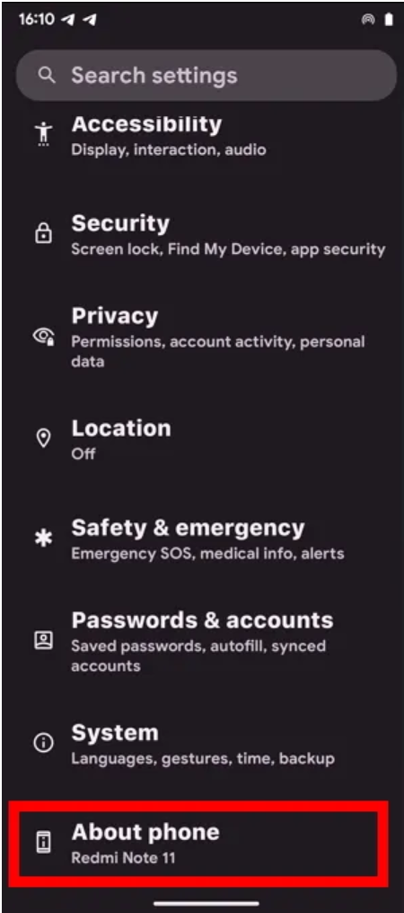
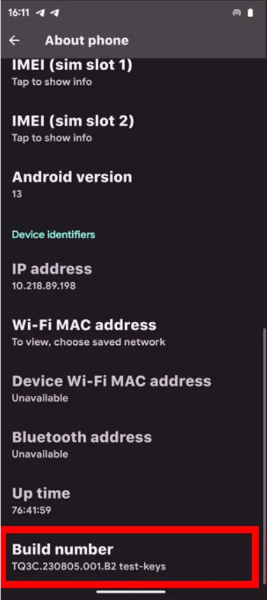
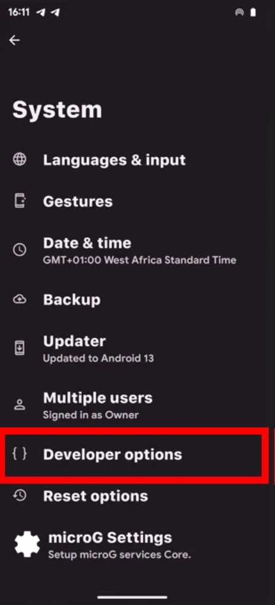
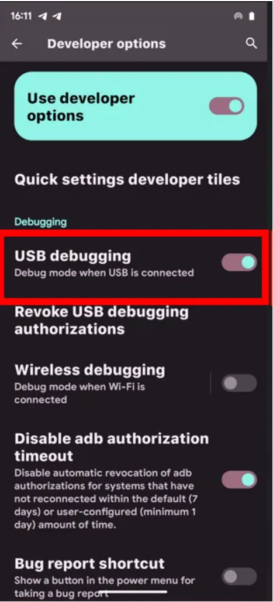
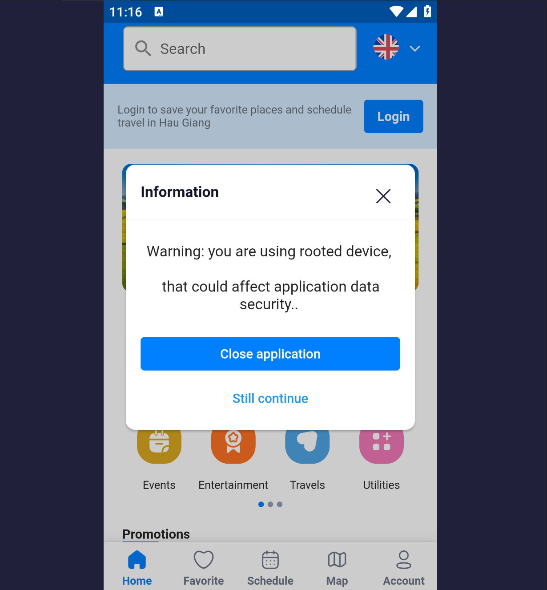
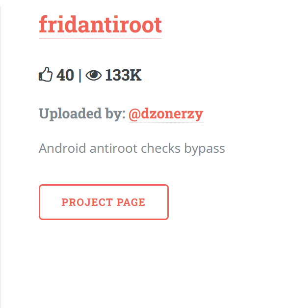
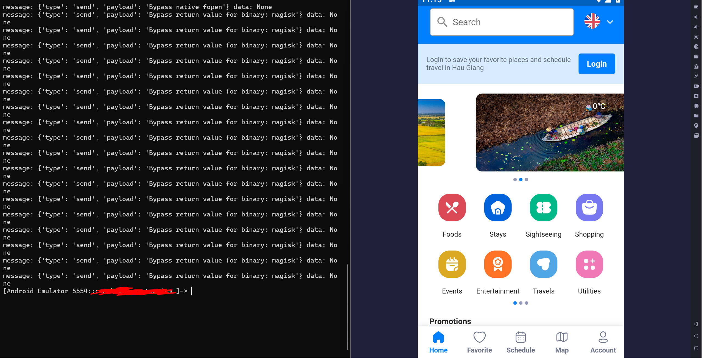

# Thiết lập môi trường dành cho pentest Android.

 - Tên tài liệu: Mobile Application Security and Penetration Testing v 2.5
 - Thực hiện: Trọng
 - Cập nhật lần cuối: 22/10/2024

# Table of Contents

 - [Rooting](#Rooting)
 - [Custom ROM](#Custom_ROM)
 - [Rooting For Pentesting](#Rooting_For_Pentesting)

1. [Rooting](#Rooting)

<a name="Rooting ">Rooting</a>

Root là quá trình người dùng thiết bị Android có thể đạt được quyền kiểm soát đặc quyền (root) trên các hệ thống con khác nhau của thiết bị, thường là điện thoại.

Vì android dựa vào nhân linux, nên quá trình root thiết bị android sẽ mang lại khả năng truy cập quyền quản trị (superuser) tương tự như trên linux.

<a name="How rooting works ">How rooting works</a>

Root là quá trình khai thác các lỗ hổng trong hệ thống Android để đạt được quyền của superuser.

Khi root được android, các cơ chế bảo mật của android sẽ bị loại bỏ. Do dựa vào nhân linux nên ở android quyền cao nhất cũng sẽ là root.Ở chế độ mặc định, quyền root sẽ bị khóa, thay vào đó sẽ là các quyền thấp như apps hay users. Do đó khi muốn pentest 1 hệ thống android, trước tiên ta phải tìm được các kĩ thuật bypass cơ chế phòng chống root của android app để không bị hạn chế về các quyền.

Trước đây, SuperSU chủ yếu được sử dụng để root các thiết bị Android. Nó cho phép người dùng cấp hoặc từ chối quyền superuser đối với ứng dụng, giúp có thể toàn quyền kiểm soát thiết bị với giao diện đơn giản và hiệu suất tốt. Hiện nay thì Magisk đã được sử dụng cho mục đích tương tự.

Magisk thực hiện một cách tiếp cận khác để root. Thay vì sửa đổi trực tiếp phân vùng hệ thống, nó tạo ra một giao diện không có hệ thống.

 - Root không có hệ thống: Magisk không thay đổi phân vùng hệ thống, giúp nó có khả năng chống cập nhật hệ thống và kiểm tra SafetyNet tốt hơn.
 - Mô-đun Magisk: Người dùng có thể dễ dàng cài đặt “Mô-đun Magisk” để thêm các tính năng, chỉnh sửa và sửa đổi cho thiết bị đã root.
 - Ẩn Root: Tính năng Magisk Hide cho phép người dùng ẩn root khỏi các ứng dụng cụ thể, bao gồm cả những ứng dụng thực hiện kiểm tra SafetyNet.
 - Mã nguồn mở: Magisk là mã nguồn mở.

Cách phổ biến nhất để root ở các thiết bị android:

 - Đầu tiên chọn ``enable developer options`` sau đó chọn ``About device``.









 - Cuối cùng ta cần cắm usb của điện thoại vào máy tính để kết nối 2 thiết bị.

2. [Custom ROM](#Custom_ROM)

Một số người dùng thay thế hệ điều hành gốc của thiết bị bằng firmware tùy chỉnh như OmniROM hoặc LineageOS. Quá trình này thường yêu cầu root thiết bị để chỉnh sửa bootloader. Một số nhà sản xuất như Google (với dòng Nexus) hỗ trợ việc mở khóa bootloader dễ dàng và an toàn hơn, giúp người dùng tránh phải sử dụng các khai thác tiềm ẩn mã độc. Cộng đồng custtom ROM thường cung cấp các bản cập nhật và hỗ trợ thường xuyên cho các thiết bị cũ hơn, có thể sử dụng các tính năng Android mới nhất trước khi được hỗ trợ chính thức.

3. [Rooting For Pentesting](#Rooting_For_Pentesting)



Khi tiến hành pentest 1 ứng dụng android, ta cần quyền root để truy cập sâu hơn vào hệ thống của ứng dụng, chẳng hạn như có thể xem được dữ liệu trong ``/data/data`` sau khi sử dụng ADB. Tuy nhiên bên cạnh đó, để ngăn chặn nguy cơ bị tấn công thì những người tạo nên ứng dụng cũng sẽ có các cơ chế chống root cho ứng dụng của họ, vì vậy nếu muốn đạt được root ta phải có các kĩ thuật dùng để bypass root detect của ứng dụng. Có thể sử dụng các công cụ như frida với các script có sẵn, objection, patch lại ứng dụng hoặc hook thẳng vào ứng dụng để sửa mã nguồn.



Đối với các script có sẵn thì có thể tham khảo tại [codeshare](#https://codeshare.frida.re/browse)

```$ frida --codeshare fdciabdul/frida-multiple-bypass -f YOUR_BINARY```



