# Thiết lập môi trường dành cho pentest Android.

 - Tên tài liệu: Mobile Application Security and Penetration Testing v 2.5
 - Thực hiện: Trọng
 - Cập nhật lần cuối: 02/10/2024

# Table of Contents

 - [Tool_Setup](#Tool_Setup)
 - [Emulator_Setup](#Emulator_Setup)
 - [Burp_Setup](#Burp_Setup)

1. [Tool_Setup](#Tool_Setup)

Để thiết lập được môi trường pentest android, việc sử dụng các công cụ có sẵn là vô cùng cần thiết. Dưới đây là các công cụ cần thiết cho việc pentest và cài đặt.

<a name="ADB (Android Debug Bridge)">ADB (Android Debug Bridge)</a>

Là công cụ dùng để tương tác và quản lý các thiết bị android hoặc các máy ảo.

Tiến hành cài đặt với câu lệnh:

```
sudo apt-get install adb
```

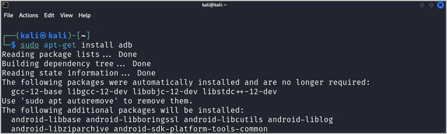

<a name="Sử dụng ADB">Sử dụng ADB</a>

Một số câu lệnh phổ biến khi sử dụng ADB:

 - ``adb start-server`` - Khởi động server.
 - ``adb kill-server`` - Dừng server.
 - ``adb devices`` - Liệt kê các thiết bị Android được kết nối với máy tính.
 - ``adb push [source] [destination]`` - Đẩy file từ máy tính sang điện thoại.
 - ``adb pull [source] [destination]`` - Kéo file từ điện thoại về máy tính.
 - ``adb shell`` - Khởi động shell từ xa, cho phép người dùng điều khiển bằng lệnh shell.

<a name="APKTool">APKTool</a>

Là công cụ dùng để dịch ngược và biên dịch lại các tệp APK.

Tiến hành cài đặt với câu lệnh:

```
sudo apt-get install apktool
```

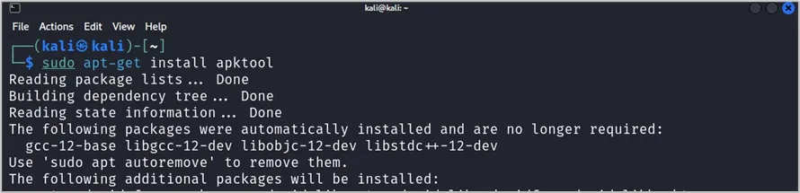

<a name="Cách dùng apktool">Cách dùng apktool</a>

 - ``apktool d <your-app.apk> -o <output-directory>`` - Decompile một APK để xem mã Smali và tài nguyên (resources).
 - ``apktool b <decompiled-folder> -o <output-apk>`` - Sau khi chỉnh sửa mã Smali hoặc tài nguyên, tiến hành recompile.

Sau khi recompile lại APK, bạn cần ký (sign) APK để nó có thể được cài đặt trên thiết bị Android.

 - ``apksigner sign --ks my-release-key.jks --out signed.apk unsigned.apk`` - Sign APK bằng apksigner.
 - ``jarsigner -verbose -sigalg SHA1withRSA -digestalg SHA1 -keystore my-release-key.jks myapp.apk alias_name`` - Sign APK bằng jarsigner.

<a name="JADX">JADX</a>

Cũng là một công cụ dùng để dịch ngược và phân tích các tệp APK. Trước tiên cần cài đặt java để cài đặt ``JADX``.

```
sudo apt-get install default-jdkv
```

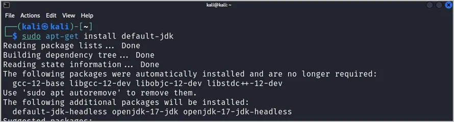

Sau đó tiến hành cài đặt ``JADX``.

```
sudo apt-get install jadx
```

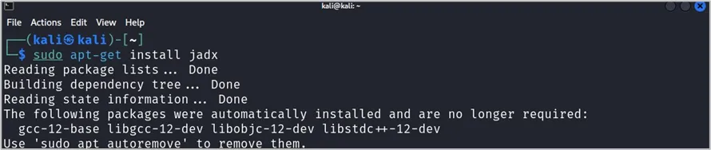

<a name="Frida Tools">Frida Tools</a>

Được dùng để phân tích và chèn mã với các ứng dụng trong lúc chạy.

```
pip3install frida-tools
```

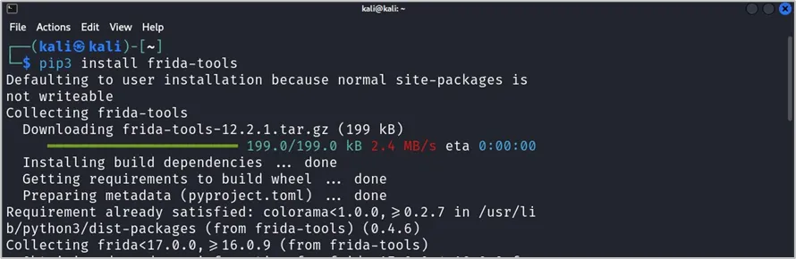

<a name="Objection">Objection</a>

Là công cụ dụng để phân tích và chèn các đoạn mã tùy chỉnh để tương tác với ứng dụng trong luc1 chạy.

```
pip3install objection
```

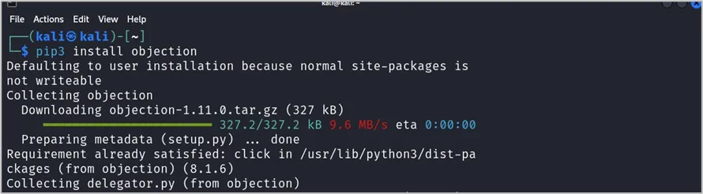

<a name="Cách sử dụng Objection">Cách sử dụng Objection</a>

Khi sử dụng emulator ta luôn tùy chỉnh ở quyền root, ta có thể chọn ứng dụng mà bạn muốn kiểm tra bên trong tùy chọn ``--gadget``.

 - ``objection --gadget com.osfg.certificatepinning explore``

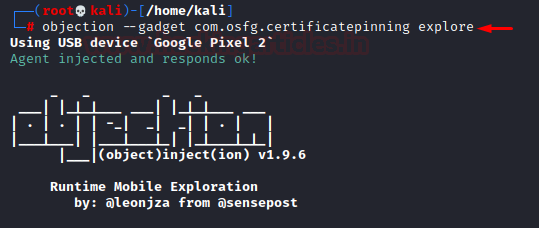

 - ``android sslpinning disable`` - Sử dụng module android sslpinning để tắt SSLPinning trong khi gói đang chạy. Objection Framework chèn một mã JavaScript hoặc sử dụng các đoạn mã từ frida để thực hiện.
 - ``android hooking list activities`` - Liệt kê tất cả các Activity.
 - ``android intent launch_activity <activity>`` - Chạy một Activity bất kỳ.
 - ``android sharedpreferences list`` - Liệt kê các SharedPreferences.
 - ``android sharedpreferences dump <file>`` - Dump nội dung của file SharedPreferences.
 - ``android database list`` - Liệt kê các cơ sở dữ liệu SQLite.
 - ``android database query <db> "<query>"`` - Dump dữ liệu từ một SQLite database.
 - ``android hooking watch class_method <class> <method>`` - Hook và theo dõi một phương thức Java.

<a name="MobSF ">MobSF</a>

Là một ứng dụng mã nguồn mở, nó có thể phân tích ứng dụng mobile để tìm ra các lỗ hổng bảo mật và các vấn đề liên quan đến bảo mật khác.

Có 2 cách để sử dụng là có thể sử dụng trực tiếp MobSF trên website online hoặc là build local ở Docker.

[MobSF Website](https://mobsf.live/), phân tích chậm và đôi khi file nặng quá thì đơ luôn.

Cách thứ 2 là build local ở Docker.

```
sudo apt install docker.io
```

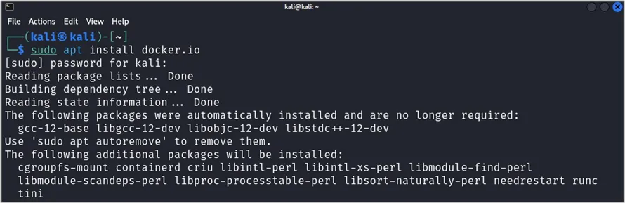

```
sudo docker pull opensecurity/mobile-security-framework-mobsf
```

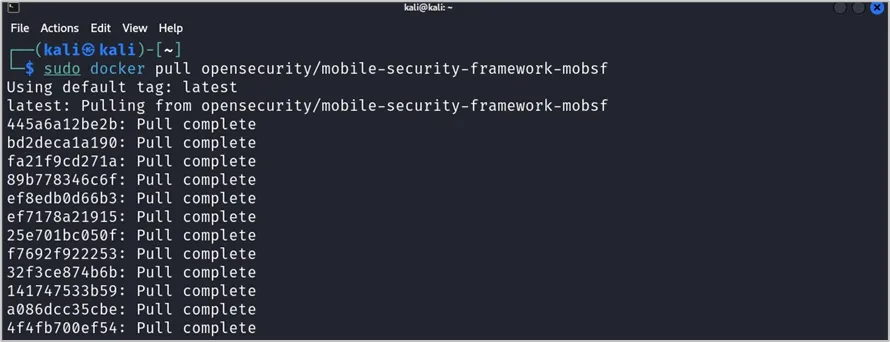

```
sudo docker run -it --rm -p 8000:8000 opensecurity/mobile-security-framework-mobsf:latest
```

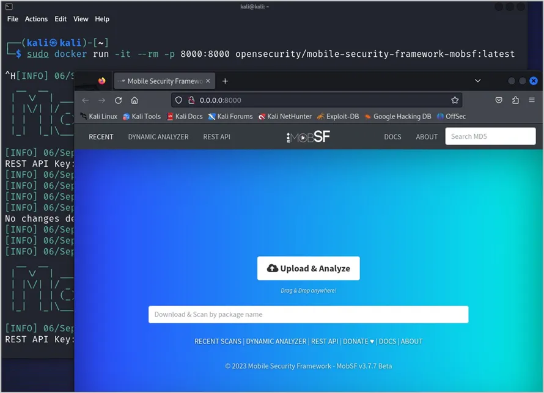

2. [Emulator_Setup](#Emulator_Setup)

Máy ảo android là phần mềm mô phỏng lại các thiết bị android giúp ta có thể thực hiện test các android app trên máy tính mà không cần phải dùng thiết bị thật.

Download bất cứ loại giả lập Android nào cũng được, ở đây mình dùng LDplayer.


Sau khi download thì tiến hành cài đặt....

Tiến hành sử dụng LDplayer.

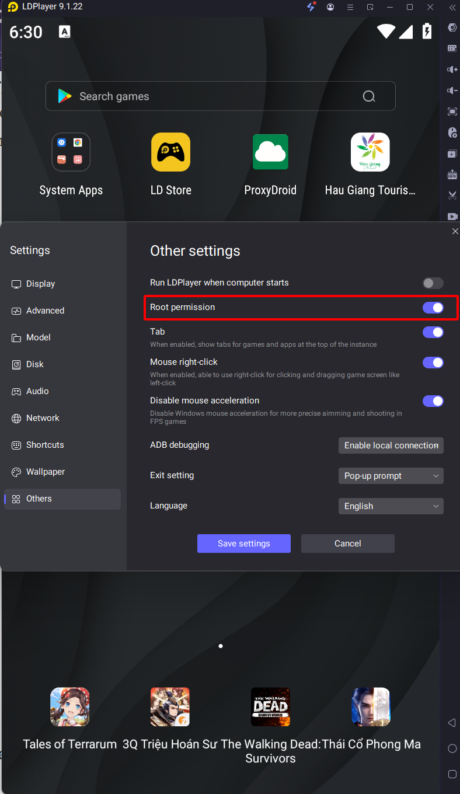

Cài đặt chế độ quyền root dành cho LDplayer.

3. [Burp_Setup](#Burp_Setup)

Để burpsuite bắt được các gói tin, ta cần phải config burpsuite tương thích với thiết bị emulator.

Đầu tiên mở burpsuite sau đó chuyển sang tab Proxy và chọn Options. Tiếp tục chọn Add để thêm proxy để lắng nghe.

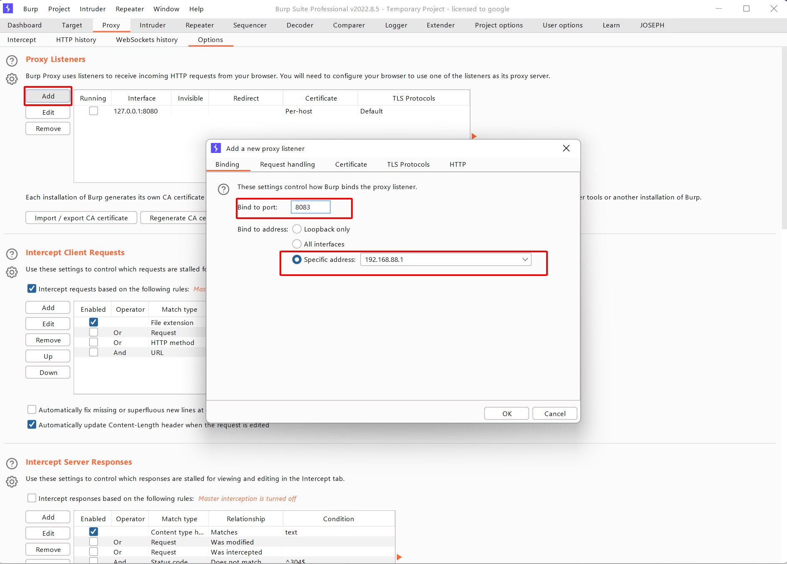

Tiếp theo tại LDplayer, mình sử dụng ProxyDroid hay có thể config lại trong phần wifi cũng được. Tại đây mình set IP và port cũng giống như của burpsuite và enable Proxy switch.

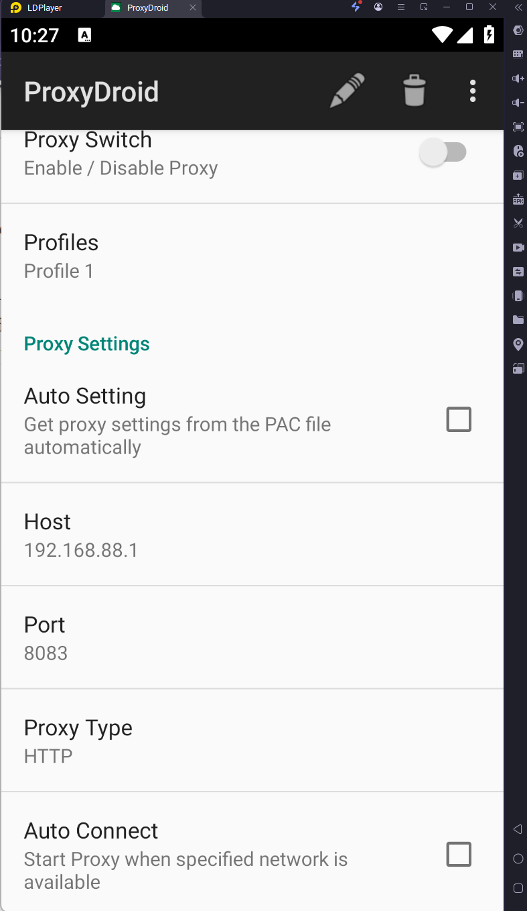

Tiếp theo mình tiến hành download cert của burpsuite. Lưu ý nhớ đổi tên file từ ``cacert.der`` -> ``cacert.cer``.

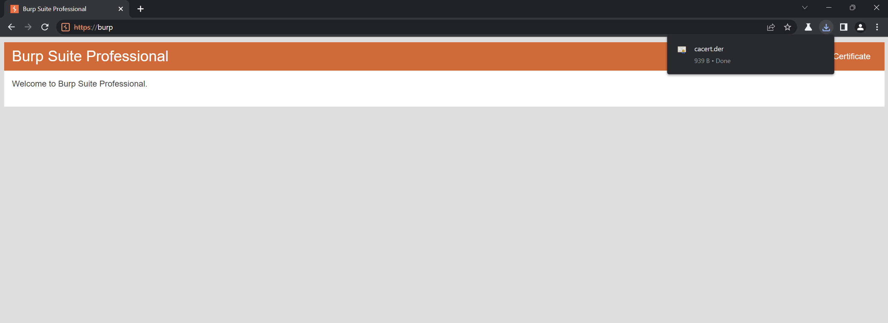

Cuối cùng chỉ cần sử dụng ADB để đẩy cert vào trong emulator là có thể bắt các request với burpsuite mỗi khi ta thao tác trên emulator.

```
adb push /downloads/cacert.der /sdcard/cacert.cer
```

Ngoài ra còn các công cụ khác có thể sử dụng ngoài các công cụ được nêu bên trên.

``Dex2jar``: Converts .dex files to .class files, zipped as a jar file.

``Drozer``: drozer is the leading security testing framework for Android.

``Ghidra``: A software reverse engineering (SRE) suite of tools developed by NSA’s Research Directorate in support of the Cybersecurity mission.

``Gmaps scanner``: Used for determining whether a leaked/found Google Maps API Key is vulnerable to unauthorized access by other applications or not.

``Keyhacks``: It shows ways in which particular API keys found on a Bug Bounty Program can be used, to check if they are valid.

``Pidcat``: logcat colour script which only shows log entries for processes from a specific application package