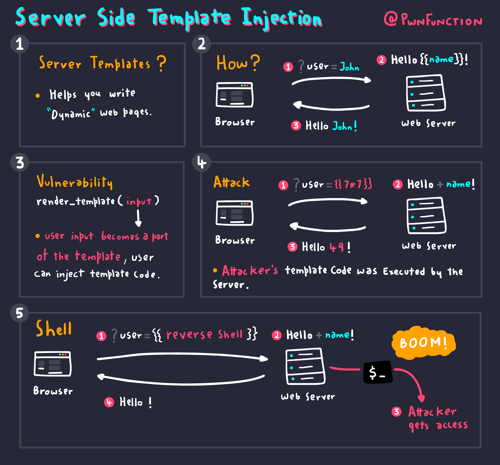
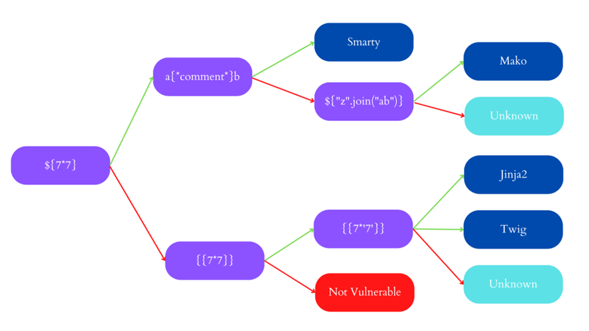

# What is Server Side Template Injection?

Server-side template Injection (SSTI) occurs when an attacker injects a malicious payload into a template using native template syntax and causes it to execute on the server.

Template engines generate web pages by combining static templates with transient data. Server-side template injection attacks can occur when user input is directly combined into a template rather than being provided as data. As a result, attackers can control the template engine by injecting arbitrary template directives. Since they are supplied and assessed on the server, server-side template injection payloads may be significantly more harmful than ordinary client-side template injections.

Let’s look at the following list of some of the most well-known template engines:

 - PHP: Smarty, Twigs
 - Java: Velocity, Freemaker
 - Python: Jinja, Mako, Tornado
 - JavaScript: – Jade, Rage
 - Ruby: Liquid

When input validation is not correctly handled on the server side, a malicious server-side template injection payload can be executed on the server, leading to remote code execution.

# What is the Impact of Server-Side Template Injection?

An attacker can frequently utilize server-side template injection as the foundation for a variety of different attacks, potentially acquiring read access to sensitive data and arbitrary files on the server, even when full remote code execution is not possible.

# Detect & Identify

Finding a weakness is the initial step in its exploitation, as it is with any vulnerability. The initial strategy that might be the simplest is to try fuzzifying the template by inserting a string of special characters that are frequently found in template expressions, like the polyglot ``${{<%[%’”}}%``. You should check for variations between the response with ordinary data on the parameter and the supplied payload to determine whether the server is vulnerable. It will be simple to determine the server’s vulnerability and even the engine that is operating if an error is thrown.

But you could also find a vulnerable server if you were expecting it to reflect the given payload and it is not being reflected, or if there are some missing characters in the response.

### Detect-Code Context 

In some instances, user input is contained within a template expression: engine.render. (“Hello, {{“+greeting+”}}”, data).

A URL similar to this one might be used to access that page: ``http://vulnerable-website.com/?greeting=data.username``

The username will not be returned if the greeting parameter is changed to a different value, but if you access something like ``http://vulnerable-website.com/?greeting=data.usernamehello`` then the username will be returned. It will be simpler to identify the server’s vulnerability if an error is thrown during these tests.

### Identify & SSTI Payload Tree

Identifying the template engine in use comes after spotting template injection. This process can occasionally be as simple as submitting incorrect syntax because template engines may recognize themselves in the error reports. This method is not suitable for automation and fails when error messages are suppressed. Instead, we’ve used a decision tree with language-specific payloads to automate this in Burp Suite. The words “success” and “failure” are denoted by green and red arrows, respectively. A same payload may occasionally yield several different success replies; for instance, the probe {{7*’7′}} might return 49 in Twig, 7777777 in Jinja2, and neither if no template language was in use.

# Exploit

# Prevent

The best method to protect websites from SSTI vulnerabilities is to never allow users to change or create templates. However, if a business emergency arises, the following options are available:

 - Sanitization.
 - Sandboxing.
 - Logic-free Template.

